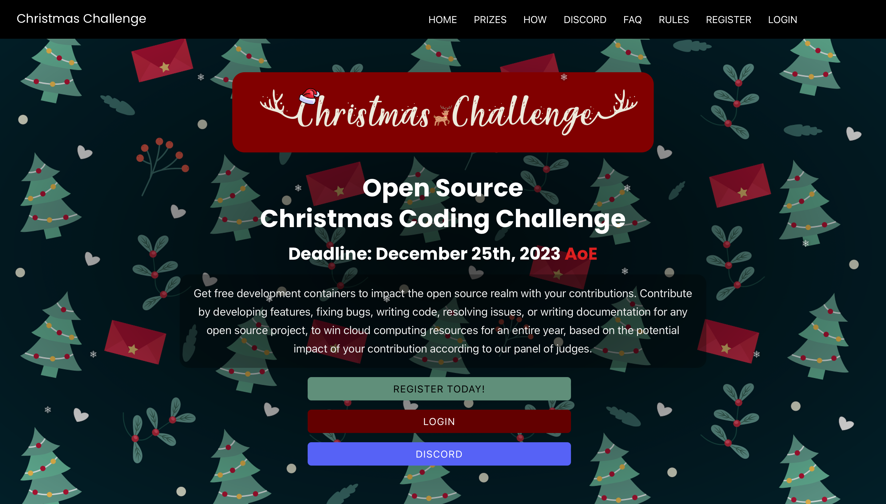

<br/>


<p align="center">
  <h3 align="center">Hackathon Platform</h3>
  <p align="center">
    A Hackathon Management Plaform built on Django
  </p>
</p>


## About The Project
Hackathon Platform is an open-source web application to help running hackathon/event by providing some fundamental features. It provides registration as well as hacker and organizer dashboards. Its fundamental features include:

1. Presentation of landing page with basic information about an event
2. Registration of hackers for the platform
3. Authentication via email and phone number verification as either incoming call or OTP code using Twilio API
4. User dashboard with tasks to do
5. Admin dashboard to view users and subpage to get some statistics about them

## Showcase



## Backend

* ### Python 3.11.5

* ### Django 4.0.3

## Frontend

* ### JavaScript

* ### HTML

* ### CSS


## Getting Started

## Before you install

`Update SMTP and Twilio settings if you want to take advantage of email and phone services.`

## Installation


1. Clone the repo

   ```shell
   git clone git@github.com:miuoshVU/open-source-hackathon-platform.git
   ```

   Note: If you don't have ssh keys setup to clone git repos, then replace the ssh link with `https://github.com/miuoshVU/open-source-hackathon-platform.git`

2. `cd` to repo

3. Create the `venv` environment and activate it
```
python3 -m venv venv
```

Linux / MacOS:
```
source venv/bin/activate
```
Windows:
```
venv\Scripts\activate
```

4. Install dependencies
```shell
pip install -r requirements.txt
```
5. Apply migrations
```shell
python manage.py migrate
```
6. Go to setup folder
```shell
cd setup/
```
7. Fill in db
```shell
sh run_seeder.sh
```
8. Go back
```shell
cd ..
```
9. Run project
```shell
python manage.py runserver
```

## Default admin
login: admin@gmail.com

password: admin12345


## License

The project uses the MIT License. More information can be accessed here [MIT]([OpenAI](https://opensource.org/license/mit/)).
